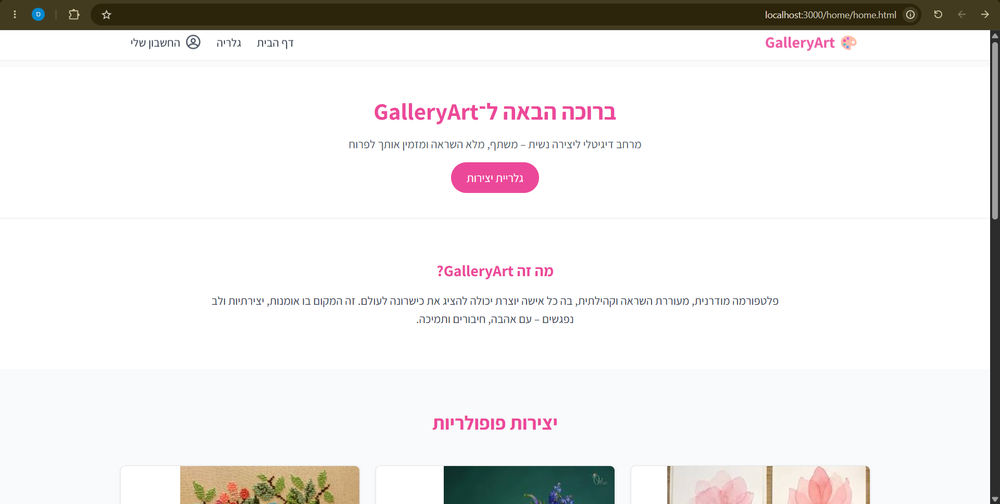
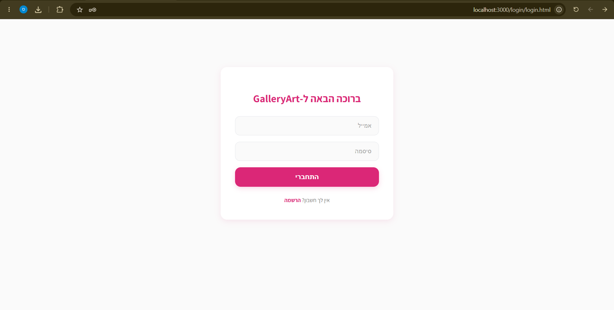
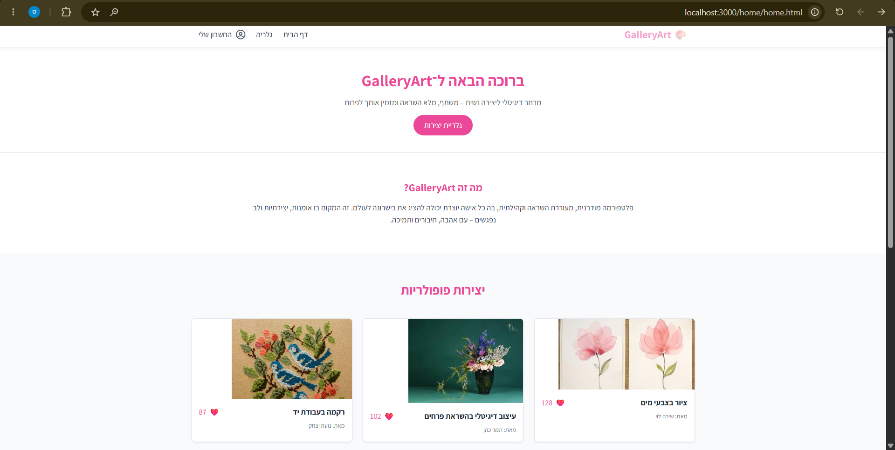
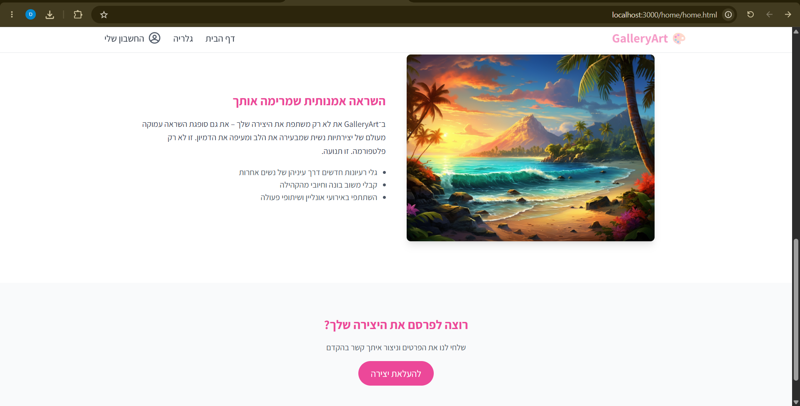
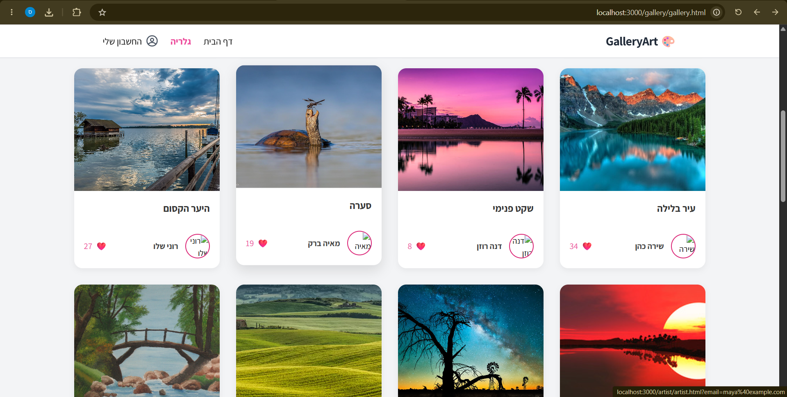
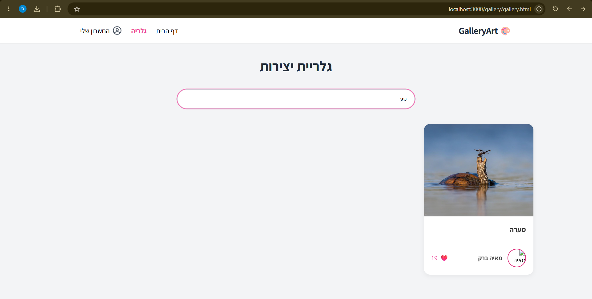
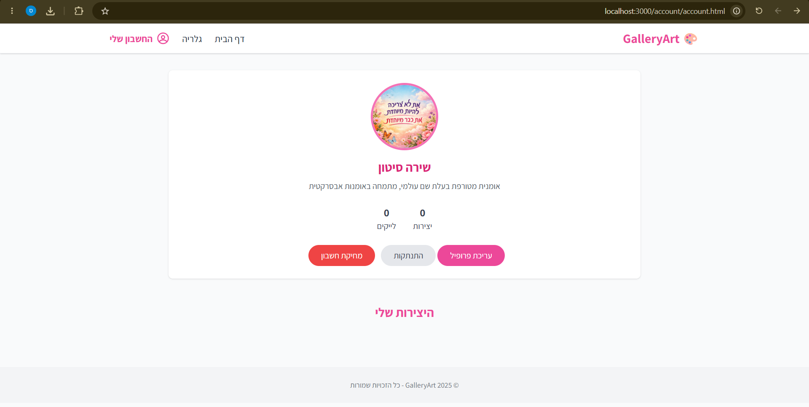
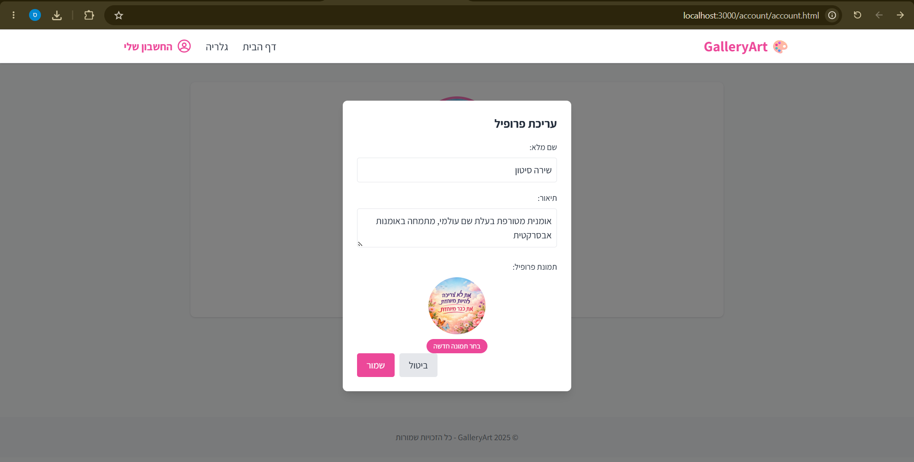
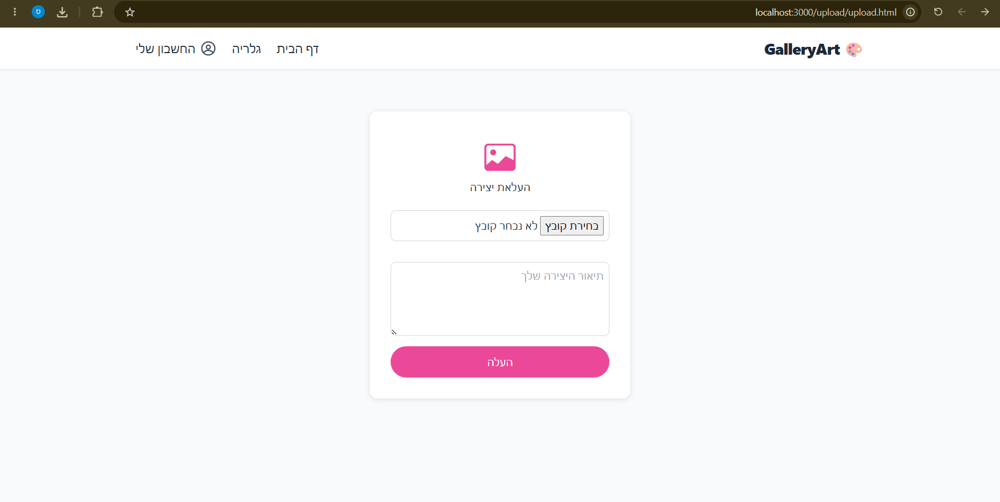

# 🎨 GalleryArt

A full-stack web application for female artists to showcase, share, and manage their artwork. Built with **Node.js**, **Express**, **MySQL**, and vanilla JavaScript — featuring JWT-based authentication, image uploads, and a responsive UI.

## ✨ Features

- **User Registration & Login** — Secure sign-up and sign-in with password hashing (bcrypt) and JWT tokens
- **Artist Profiles** — Each user gets a profile page with their bio, profile picture, and artwork gallery
- **Artwork Gallery** — Browse all uploaded artwork with search by title, description, or artist name
- **Image Upload** — Upload artwork images with live preview before submitting
- **Account Management** — Edit profile, change profile picture, update artwork titles, delete artwork, or delete account entirely
- **JWT Authentication** — Protected routes for sensitive operations (upload, edit, delete)
- **Responsive Design** — Works on desktop and mobile, styled with Tailwind CSS and custom CSS

## 🛠️ Tech Stack

| Technology | Purpose |
|------------|---------|
| **Node.js** | JavaScript runtime |
| **Express** | Web server & routing |
| **MySQL** | Database |
| **bcrypt** | Password hashing |
| **jsonwebtoken** | JWT authentication |
| **multer** | File upload handling |
| **Tailwind CSS** | Utility-first styling |

## 📁 Project Structure

```
myGallary/
├── client/                  # Frontend (served statically by Express)
│   ├── account/             # Account management page
│   ├── artist/              # Artist profile page
│   ├── gallery/             # Artwork gallery
│   ├── home/                # Landing page
│   ├── images/              # Static images
│   ├── login/               # Login page
│   ├── register/            # Registration page
│   └── upload/              # Artwork upload page
├── server/                  # Backend (Express API)
│   ├── controllers/         # Request handlers
│   ├── DB/                  # Database connection & schema
│   ├── middleware/          # Auth & file upload middleware
│   ├── models/              # Database queries
│   ├── routers/             # Route definitions
│   ├── uploads/             # Uploaded images directory
│   ├── .env                 # Environment variables
│   └── server.js            # Entry point
└── README.md
```

## 🚀 Getting Started

### Prerequisites

- **Node.js** (v18 or higher)
- **MySQL** (v8 or higher) — installed and running locally

### Installation

1. **Clone the repository**
   ```bash
   git clone https://github.com/your-username/myGallary.git
   cd myGallary
   ```

2. **Install dependencies**
   ```bash
   cd server
   npm install
   ```

3. **Set up the database**
   
   Open MySQL and run the schema file:
   ```bash
   mysql -u root -p < server/DB/GalleryArt.sql
   ```
   
   Or open `server/DB/GalleryArt.sql` in MySQL Workbench and execute it.

4. **Configure environment variables**
   
   Edit `server/.env` with your MySQL credentials:
   ```env
   DB_HOST=localhost
   DB_USER=root
   DB_PASSWORD=your_mysql_password
   DB_PORT=3306
   SecretKey=your_secret_key_here
   ```

5. **Start the server**
   ```bash
   npm start
   ```

6. **Open the app**
   
   Visit [http://localhost:3000](http://localhost:3000) in your browser.

## 📸 Screenshots

| Page | Preview |
|------|---------|
| **Register** |  |
| **Login** |  |
| **Home Page (Top)** |  |
| **Home Page (Bottom)** |  |
| **Gallery** |  |
| **Search in Gallery** |  |
| **User Profile** |  |
| **Edit Profile** |  |
| **Upload Artwork** |  |

## 🤝 Contributing

Contributions, issues, and feature requests are welcome!

## 👩‍🎨 Authors

**Shira Siton** & **Sulamit Wolfson**

*Academic project — 2025*

## 📄 License

This project is for personal portfolio purposes.
